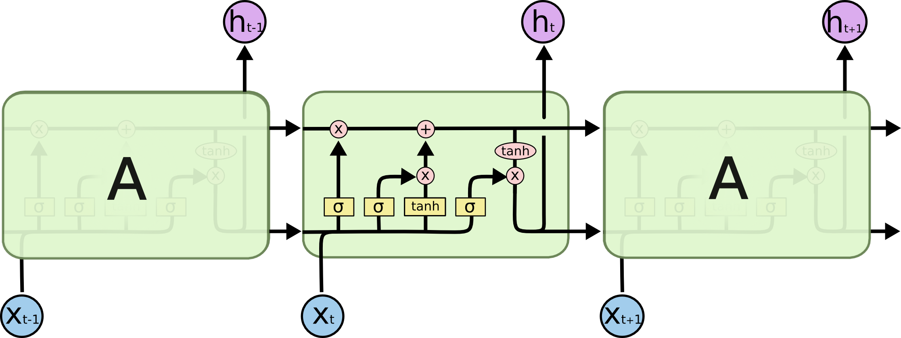
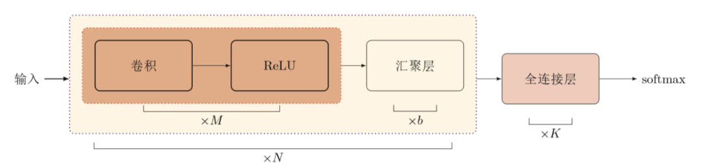
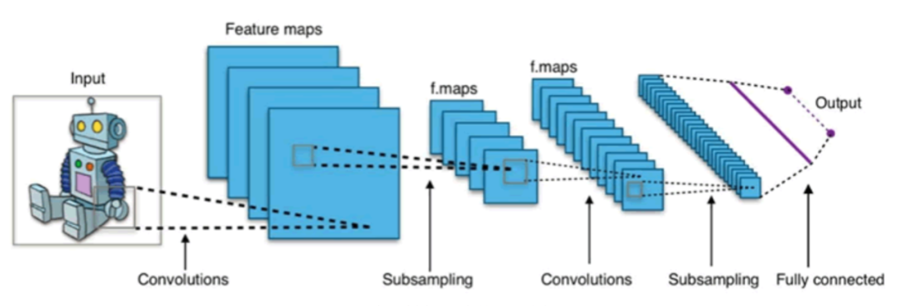
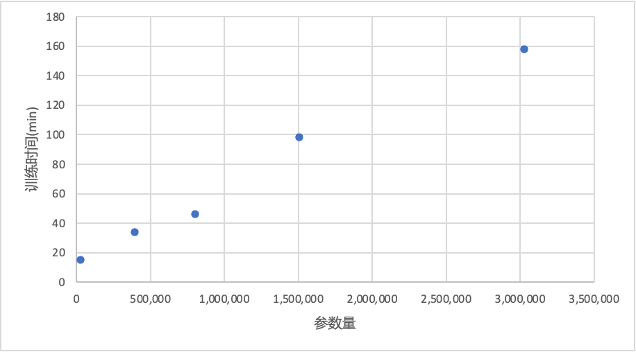

# 基于神经网络的心电图分类算法研究
## 1. 介绍

心血管疾病是指影响心脏和血管健康的各种疾病，包括冠心病、心肌病、心律失常等，是全球范围内的头号杀手。随着现代生活压力的不断增大，人们越来越关注心血管健康问题。传统的医生问诊方式存在误诊率高、诊断不及时等弊端，而心血管疾病发病急、宜早治疗的特点更加强调了诊断的准确性和及时性。许多心血管疾病的病发初期常伴有心律失常的出现，因此心律失常的检测对于心血管疾病的预防具有重要意义。目前，广泛应用的心律失常检测方法是心电(ElectroCardioGram，ECG) 信号诊断。

传统处理心电图信号分类问题的机器学习方法为自回归模型、支持向量机等。近年来，神经网络的兴起为心电图的识别提供了多种解决方案。其中，一种效果良好的方法为对信号进行滤波处理后使用循环神经网络（RNN）进行特征分析；此外，深度学习的兴起为心电图的识别提供了一种端到端的解决方案。研究指出，卷积神经网络（CNN）中每个卷积核相当于一个滤波器，能够从原始信号中提取出有用的信息，因此可以达到信号滤波同样的作用，与此同时同步进行特征提取，从而可以直接将原始心电数据输入到模型中进行分类。本实验受到以上两种广泛使用的网络结构的启发，提出了一种利用CNN作为滤波器和特征提取器、利用RNN处理前者提取特征的网络结构，兼具两者优点，并在计算时间、收敛速度、准确率上达到了极好的tradeoff。

## 2. 实验目的

本实验旨在探索高效的深度学习算法，对人体心电信号进行分类，以判断被测试者心跳是否正常，或者患有何种心脏疾病。最终的目标是实现心电数据的5分类。通过这种方法，可以减少人工处理心电数据的工作量，提高诊断的准确性和效率。同时，该方法还可以为未来的心血管疾病预测和早期预防提供新的思路和方法。

## 3. 实验原理和方法

### 3.1 心电图和心率失常

心电图的原理基于心脏的电活动，即心脏肌肉在收缩和舒张过程中产生的微弱电信号。这些电信号可以通过在身体表面放置多个电极，从而形成导联，进而测量和记录心电图。心电图记录了心脏电活动在时间和振幅上的变化，提供了关于心脏节律、传导系统、心室和心房肥厚以及心肌缺血等方面的信息。

心电图波形主要包括P波、QRS波群和T波。P波代表心房的除极，QRS波群反映心室的除极，而T波表示心室的复极。这些波形的形态、幅度和间隔可以提供诸如心律、传导异常和心肌缺血等方面的信息。当发生心律失常时，心脏出现不规律跳动，心脏节律发生改变，心电图中监测到的电信号也会随之出现明显变化。

### 3.2 小波变换

受采集环境的影响，ECG信号中通常存在许多干扰信号和基线漂移。为了获取精准的心脏活动信号，避免噪声干扰产生误判，我们通常需要对ECG信号进行滤波，常用手段为小波变换(wavelet transform)。

小波变换是一种经常用于分析非平稳时间序列数据并提取有意义和正确特征的方法。广泛使用的方法为离散小波变换（DWT）。DWT是一种通过串行数字滤波器传递信号来降低连续小波计算成本并得出系数的方法。这种分解方法也被称为多分辨率分析。这些滤波器组包括高通（HP）和低通（LP）滤波器，如方程(1)和(2)所示，
$$
H=\sum_{k=-\infty}^{\infty}S[k]\varphi_{h}[2n-k]
$$

$$
L=\sum_{k=-\infty}^{\infty}S[k]\varphi_{g}[2n-k]
$$

其中S为输入信号，H和L分别为高通和低通滤波器的输出，$φ_h$和$φ_g$分别为低通和高通滤波器。高通滤波器输出包括输入信号的细节系数（D），低通滤波器输出包含近似系数（A）。通过滤波器的信号进行下采样，以增加频率分辨率。下图中展示了这些分解过程逐级进行的过程。 首先，输入信号S经过高通和低通滤波器，以获得第一级的细节和近似系数。然后，获得的近似系数再经过滤波器以获得第二级的分量。这个过程一直重复，直到达到指定的级别。

### 3.3 循环神经网络

循环神经网络（RNN）在序列的演化方向上进行递归，通过链式连接所有节点。每个节点都位于序列中，其神经元的输出用于下一个节点的输入，从而使得RNN能够根据先前的计算生成输出。这对于处理时间序列数据非常有用。

然而，传统的RNN在处理长期依赖性时效果较差。因此，Hochreiter和Schmidhuber提出了一种称为长短期记忆（LSTM）的方法来解决这个问题。在LSTM中，每个节点都用记忆单元代替了传统RNN中的节点。LSTM的核心思想是不断更新记忆单元中的记忆，保留有用的信息并舍弃冗余的信息。每个输入都需要经过三个门：遗忘门、输入门和输出门，如下图所示。

简单来说，LSTM内部发生的过程有以下三个：

1. 由遗忘门$f_t$控制的忘记阶段。这个阶段主要是对上一个时刻传进来的记忆$c_{t-1}$进行**选择性**忘记。

2. 由输入门$i_t$控制的选择记忆阶段。这个阶段结合当前时刻的输入$x_t$和上一时刻的输出$h_{t-1}$有选择性地进行“记忆”。

   前两个阶段简单来说就是会 “忘记不重要的，记住重要的”，形成当前记忆$c_t$。

3. 由输出门$o_t$输出阶段。根据当前的记忆$c_t$进行输出$h_t$

接下来是具体的数学计算。对于输入$x_t$和上一个时间步骤短期记忆的输出$h_{t−1}$，遗忘门$f_t$和输入门$i_t$通过以下公式计算
$$
f_t=∂(w_f[h_{t−1},x_t]+b_f)
$$

$$
i_t=∂(w_i[h_{t−1},x_t]+b_i)
$$

其中∂是激活函数，返回介于0和1之间的值。引入长记忆单元$c_t$，其随时间更新很慢：
$$
\hat{c_t} =\tanh(w_c[h_{t−1},x_t]+b_c)
$$

$$
c_t=f_tc_{t−1}+i_t\hat{c_t}
$$

最后，根据输出门$ot$计算输出$h_t$：
$$
o_t =∂(w_o[h_{t−1},x_t]+b_o
$$

$$
h_t =o_t ∗\tanh(c_t)
$$

LSTM是心电图诊断模型中最常用的RNN算法。通过结合前向LSTM和后向LSTM，提出了双向LSTM（Bi-LSTM），这在实验中已被证明是有效的。

### 3.4 卷积神经网络CNN

一个典型的卷积神经网络是由卷积层、池化层、全连接层交叉堆叠而成。如下图所示，图中N个卷积块，M个卷积层，b个池化层（汇聚层），K个全连接层。其中，ReLU为激活函数。

## 4. 实验内容

### 4.1 数据处理

本实验使用的心电图数据库为The PhysioBank MIT-BIH arrhythmia database，该数据库包含了来自不同性别和年龄的个体的超过30分钟长的心电信号，采样频率为360Hz，导联方式为MLII和V5。该数据库中共有48个记录。专家们已经对存储在数据库中的记录中的心搏进行了注释。在本实验中中，使用了来自MIT-BIH数据集中出现频次最多的五种心搏类型：正常窦律（NSR）、室性早搏（VPC）、起搏搏动（PB）、左束支传导阻滞（LBBB）和右束支传导阻滞（RBBB）。下图中给出了实验中使用的心搏类型的波形图。

这五种心搏在实验数据集中的分布如下表所示。由于正常窦律（NSR）的出现频次远多于其他异常情况，直接在原数据集上训练模型很容易过拟合(overfitting)到将所有心搏都预测为NSR，因此，为了保证模型识别各种异常搏动的能力，确保模型不会过拟合，我们在数据处理时对标签为NSR的数据进行了1/7概率的采样，从而保证各种心搏都处于相近的数量级上。对于采样后的心拍数据，我们以心拍最高点为一段心电信号的中心，以1s(360个数据点)为窗口大小，对心电信号进行分割。最终得到了共计36,838条，每条长度为1s(360个数据点)的心电信号。对于这些数据，按0.25/0.75的比例随机划分出测试集和训练集。我们最终报告的精确度均为在模型从未训练过的测试集上的测试结果。

| Annotation | Original | After Sampling |
| :--------: | :------: | :------------: |
|    NSR     |  74749   |     10770      |
|    VPC     |   7123   |      7123      |
|     PB     |   3619   |      3619      |
|    LBBB    |   8071   |      8071      |
|    RBBB    |   7255   |      7255      |
|   Total    | 100,817  |     36,838     |

### 4.2 模型设计和改进

在考察文献后，我们首先设计了以下三种模型。并结合前三种模型的实验结果和对神经网络的认识自主设计了第四种模型。

#### 4.2.1 Baseline: WT-LSTM

参考文献可知，Ozal Yildirim使用小波变换滤波结合LTSM的方法在ECG分类的任务上达到了极高的99.39%的准确率。同时Yildirim的工作系统的比较了小波变换滤波层数、单向LSTM和双向LSTM导致的模型性能上的差别。因此我们也将这些变量（小波变换滤波层数、单/双向LSTM）考虑进去。Yildirim与我们使用的数据集都源自MIT-BIH arrhythmia database，标注的选取、数据的分割方法均相同，本实验也采取了与Yildirim论文中一致超参设置。因此，我们将此模型视作本实验比较的baseline。然而Yildirim仅选取了其中总共7,376条数据进行训练和验证，与本实验选用的数据集总量36,838有着数量级的差距。在本实验的数据集上我们并没有复现出和Yildirim报告中一样的准确率，本实验中用这种模型在数据集上训练后所能达到的最高准确率为99.07%，因此，后续实验中我们将此数据作为本实验的比较baseline。

#### 4.2.2 CNN

参考文献可知，Acharya使用一维的多层CNN结合前馈网络(FNN)在ECG分类的任务上达到了94.03%的准确率。Acharya认为多层CNN可以承担滤波器、特征提取器、特征分析器的作用，只需要将CNN提取出来特征输入给多层的FNN，就可以完成对ECG分类的任务。我们在Acharya提出的网络结构的基础上，给每个卷积层后都加上BatchNormalization层（将有效改善模型稳定性和改善梯度消失和爆炸等问题），并在最后多层FNN网络之间加上概率$p=0.1$的dropout层，防止模型过拟合。

#### 4.2.3 CNN-LSTM

基于对前两个模型的认识，本实验提出了一种利用CNN作为滤波器和特征提取器，单/双向LSTM作为特征分析器的模型结构。所用的单/双向LSTM结构参数与4.2.1中一致，区别仅为使用了4.2.2中CNN的前两层作为滤波去和特征提取器。该模型的具体参数见下表。

| Layer | Layer Names           | Main Parameters                                    |
| ----- | --------------------- | -------------------------------------------------- |
| 1     | Convolution Layer     | kernel_size = 3,  stride = 1, output_features = 5  |
| 2     | BatchNorm Layer       | -                                                  |
| 3     | Max-pooling Layer     | kernel_size = 2,  stride = 2                       |
| 4     | Convolution Layer     | kernel_size = 4,  stride = 1, output_features = 10 |
| 5     | BatchNorm Layer       | -                                                  |
| 6     | Max-pooling Layer     | kernel_size = 2,  stride = 2                       |
| 7     | UniLSTM/ BibLSTM      | hidden_size=64                                     |
| 8     | Dropout Layer         | p=0.1                                              |
| 9     | UniLSTM/ BibLSTM      | hidden_size=32                                     |
| 10    | Dropout Layer         | p=0.1                                              |
| 11    | Flatten               | -                                                  |
| 12    | Fully-connected Layer | output_features=128                                |
| 13    | Dropout               | p=0.2                                              |
| 14    | Fully-connected Layer | output_features=5                                  |
| 15    | Softmax Layer         | -                                                  |

## 5. 实验结果与分析

本实验在之前确定的36,838条数据集上，按照[bacth_size, num_of_eopchs, learning_rate]=[128, 50, 1e-4]的超参设置，使用Adam优化器，分别对单/双向WT-LSTM、CNN、单/双向CNNLSTM模型进行训练和测试。

在我们的实验中，发现对于WT-LSTM模型，小波变换滤波层数level取2～4之间时对实验结果的影响很小，因此本实验只报告了level取3的单/双向WT-LSTM的实验结果，并没有对小波变换滤波层数level的影响做展开讨论。

在接下来的实验结果中，用WT-uniLSTM用于指代Yildirim提出的3重滤波的单向(unidirectional)WT-LSTM，WT-bidLSTM用于指代3重滤波的双向(bidirectional)WT-LSTM，CNN用于指代Acharya提出的多层卷积神经网络，CNN-uniLSTM用于指代本实验自主提出的单向(unidirectional)CNN-LSTM网络，CNN-bidLSTM用于指代双向(bidirectional)CNN-LSTM网络

### 5.1 准确率

下表中记录了在同样训练设置下经过训练的五种模型在测试集上的表现，考虑到模型可能在不到50个epoch其实就已经收敛到了一个最优位置，后续的epoch反而会造成相较最优位置的微小偏移，我们报告了一个模型在训练过程中在测试集上的最好表现，来代表模型在该任务上的能力。

首先对于本文所选取的基线，即Yildirim提出的WT-LSTM系列的单向和双向模型，我们复现论文中提出的模型最终分别达到了98.83%和99.07%的准确率，而并没有达到论文中报告的99.25%和99.39%之高。其中，双向模型WT-bidLSTM依靠两倍于单向模型WT-uniLSTM的参数量仅达成了0.2%的性能提升，这与论文中得到的结果几乎相同。此外，由Acharya提出的最简单的多层CNN模型，在数据集上达到了较为理想的99.07%的准确率。

本实验提出的，使用CNN前两层作为滤波器和特征提取器和LSTM作为特征分析器的CNN-LSTM系列模型在测试结果上表现十分惊艳。采用单向LSTM的CNN-uniLSTM达到了99.01%，而采用双向LSTM的CNN-bidLSTM达到了99.39%，在所有测试模型中的准确率最佳。

| 序号 | Model Name  |    Acc     |   参数量   | 训练时间(min) |
| :--: | :---------: | :--------: | :--------: | :-----------: |
|  1   | WT-uniLSTM  |   98.83%   | 1,505,797  |     98.29     |
|  2   | WT-bidLSTM  |   99.07%   | 3,027,205  |    157.97     |
|  3   |     CNN     |   98.95%   | **27,035** |   **15.12**   |
|  4   | CNN-uniLSTM |   99.01%   |  393,481   |     33.80     |
|  5   | CNN-bidLSTM | **99.39%** |  802,313   |     46.27     |

我们进一步计算了CNN-bidLSTM在测试集上的混淆矩阵（一种机器学习中对模型在分类任务上表现的常用衡量方法），如下表所示。该表中行坐标表示实际的信号标签，前五行列坐标表示预测得到的信号标签。同时计算了该模型对各种类别信号的鉴别的准确度(acc)和敏感度(sen)。其中这里的准确度是对单个标签信号的识别准确度，例如对于NSR这类信号，准确度计算的是信号为NSR时判断为NSR、信号为非NSR时判断为非NSR的概率；而敏感度计算得的是信号为NSR时判断为NSR的概率，敏感度又被称为recall。这两个指标是我们在机器学习中处理分类问题的常用指标。

观察下表中CNN-bidLSTM模型对五种信号的准确度(acc)和敏感度(sen)，我们不难发现CNN-bidLSTM在处理VPC信号时的敏感度较低。这启发我们CNN-bidLSTM对VPC信号的敏感程度较低，我们可以通过提高VPC信号在数据集中的出现频率来使模型对VPC信号更好的建模，为我们的后续实验提供改进的方向。

| Origin\Predicted | NSR  | VPC  |  PB  | LBBB | RBBB | acc(%) | sen(%) |
| :--------------: | :--: | :--: | :--: | :--: | :--: | :----: | :----: |
|       NSR        | 2649 |  10  |  0   |  3   |  4   | 99.46  | 99.36  |
|       VPC        |  24  | 1772 |  0   |  1   |  1   | 99.50  | 98.55  |
|        PB        |  0   |  0   | 924  |  0   |  1   | 99.99  | 99.89  |
|       LBBB       |  7   |  10  |  0   | 2017 |  0   | 99.77  | 99.16  |
|       RBBB       |  2   |  0   |  0   |  0   | 1785 | 99.91  | 99.89  |

通过对(1)WT-uniLSTM、(2)WT-bidLSTM、(3)CNN、(4)CNN-uniLSTM、(5)CNN-bidLSTM五种模型在测试集的表现对比我们可以得出以下结论：

1. 双向LSTM相较单向LSTM在准确率上更有优势
2. CNN可以作为不弱于传统小波变换等滤波方式的强大且高效的滤波器使用
3. LSTM处理序列信号的能力较单纯的CNN更强
4. CNN-LSTM处理带噪声的心电图信号的能力极佳

### 5.2 训练时间和收敛速度

我们在本节进一步研究五种模型的训练时间和收敛速度，以期找到效率最高的模型来处理心电图分类任务。下图中是五种模型的参数量和相同硬件条件、训练设置下训练总用时长。可以看出，训练时长和模型参数量近似服从正比关系。在本实验训练的五种模型中，WT-bidLSTM参数量最大、训练时间最长，CNN参数量最小、训练时间最短。CNN-LSTM系列的两种模型参数量、训练时间中等。我们认为，本实验提出的CNN-bidLSTM不但具有上节所述的精准度的优势，还具有训练成本较小的优势。这同样意味着在相同的成本下，CNN-bidLSTM将具有更低的训练和部署成本。

当然我们需要额外指出，实验中讨论的五种模型在2023年实验室的硬件条件来看，来都是训练、部署成本很小的小模型，参数量最大的WT-bidLSTM的模型文件大小也仅为12Mb，笔记本电脑正常的cpu基本都能对这些模型进行训练和部署。但是如果考虑到实际应用层面，要批量部署到开发板等终端上时，CNN-bidLSTM较低的参数量将很大程度上节约部署成本。

下面两张图是训练过程中模型在测试集上的准确度(test_acc)和在训练集上的损失(train_loss)随训练步数的变化（其中损失-step图做了一定的平滑处理）。本实验按提出的CNN-bidLSTM在同样的训练配置下loss下降最快，很快收敛到了准确度较高的位置。这也从侧面表现出CNN-bidLSTM的结构非常贴合心电图分类任务。

### 5.3 少量数据集上的训练效果

考虑到实际应用时对心电图心搏信号的标注成本可能较大，我们能获取到经过标注的心电图数据可能较为有限，本实验还额外在原来构建的数据集上进行了比例为0.2的采样，构建出一个小数据集，其数据分布和大数据集一致，大小仅为其1/5，总量有7,339个长度为1s(360个采样点)的心搏信号，对应约为2h的总信号长度。该数据集各种心拍及原数据集的各种心拍如下表所示，可以用于模拟信号标注成本较大、仅有少量良好标注数据的情况。

| Annotation | Large | Small |
| :--------: | :---: | :---: |
|    NSR     | 10770 | 2101  |
|    VPC     | 7123  | 1383  |
|     PB     | 3619  |  714  |
|    LBBB    | 8071  | 1636  |
|    RBBB    | 7255  | 1505  |
|   Total    | 36838 | 7339  |

我们在该数据集上用提出的五种模型结构分别在本节提出的小训练集(small)上进行训练和测试，考虑到单论数据量减少，我们将训练总epoch数量增加为80，其余训练设置与原先保持不变，训练集和测试集的划分比例与原来保持不变，即0.75/0.25。测试集上的准确度acc和训练集上的loss如下图所示（其中损失-step图做了一定的平滑处理）。

可以看到，CNN-bidLSTM延续了收敛速度极快的特点，且在少量数据集上也能较为稳定地收敛在最优位置处。反观其他几种模型，由于数据量仅为原来的1/5，训练过程的不稳定性增加。下表为五个模型在测试集上达到的最好效果。可以看到相比大数据集，在小数据集上训练的模型精准度有较为明显的下降，CNN模型效果下降了3.5%，其他模型均有约1%的下降。然而本实验提出的CNN-bidLSTM表现依旧最好，且拉开了与WT-LSTM和CNN模型表现上的差距。仅使用单向LSTM的CNN-uniLSTM的准确率也显著高于其他模型，这说明CNN-LSTM系列模型可以仅从少量的数据中学到最多心电信号的普遍特征，侧面反映出其处理心电信号的优势。

| Model Name  |    Acc     |
| :---------: | :--------: |
| WT-uniLSTM  |   97.33%   |
| WT-bidLSTM  |   98.04%   |
|     CNN     |   95.59%   |
| CNN-uniLSTM |   98.26%   |
| CNN-bidLSTM | **98.58%** |

## 6. 实验结论

本实验基于神经网络实现了对心电图信号的5分类。实验中首先复现了前人提出的WT-LSTM模型和CNN模型，基于对实验结果理解将这两种模型融合，将CNN模型的前两层作为信号的滤波器和特征提取器，WT-LSTM模型的LSTM部分作为特征分析器，提出了一种CNN-LSTM系列的模型。实验结果表明，双向的CNN-bidLSTM在测试集测试效果极佳，达到了99.39%的准确率，超过了WT-LSTM和CNN模型。CNN-LSTM系列模型还在训练和部署成本上具有显著优势，在面对数据集数量少的情况下也达到了最高98.58%的准确率，远超过其他模型。因此CNN-LSTM系列模型在实际应用中具有重要优势。
